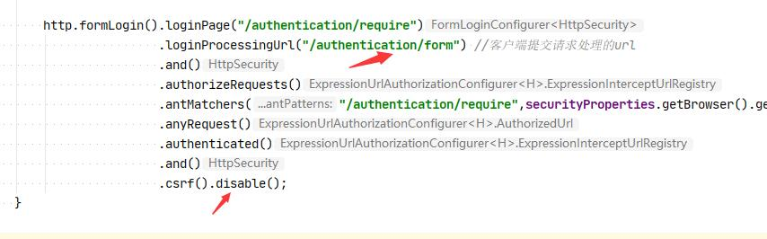

**a**
*a*
---
a
# 一级标题
## 二级标题
### 二级标题
#### 二级标题
一级标题
===========
 二级级标题
 ------------
 [百度](http://www.baidu.com "百度")
---
==~~标~~记文本==
~ asdasd ~
---
* 1
* 2
---
+ 1
+ 2
---
1. 123123
2. 12312312
---
a. 123123
<br/>
b. 1231231
---
123123
===
> 1    This is a blockquote with two paragraphs. Lorem ipsum dolor sit amet,
 consectetuer adipiscing elit. Aliquam hendrerit mi posuere lectus.
 Vestibulum enim wisi, viverra nec, fringilla in, laoreet vitae, risus.

> 2    Donec sit amet nisl. Aliquam semper ipsum sit amet velit. Suspendisse
 id sem consectetuer libero luctus adipiscing.
        <  12312312 >
* red
* gren

+ 1
+ 2

- 1
- 2
1.   1
2.   3
---
*   Lorem ipsum dolor sit amet, consectetuer adipiscing elit.
Aliquam hendrerit mi posuere lectus. Vestibulum enim wisi,
viverra nec, fringilla in, laoreet vitae, risus.
        
        1231
        123123
        123
        
    > this is a  body
        
*   Donec sit amet nisl. Aliquam semper ipsum sit amet velit.
Suspendisse id sem consectetuer libero luctus adipiscing.
------
Here is an example of AppleScript:

    tell application "Foo"
        beep
    end tell
   
-------

* * *
---
`qweqweqweqw`
---

---
1. 123
    - 123123
2. 123
3. 

```javascript 1.8
    $(document).ready(function(){
    
    })
```
---
|  表头   | 表头  |
|  :----  | :----:  |
| 单元格  | 单元格 |
| 单元格  | 单元格 |
| 单元格  | 单元格 |


<mark>标记文本</mark>


== 标记文本 ==
==标记文本==

- [ ] 1231
- [x] 完成任务


